# 05 STL BENCHMARK [Run on (4 X 3100 MHz CPU s)]

## Implementacja operatorów porównania i funkcji hashujących

W strukturze Small podczas definiowania operatorów wystarczyło porównać tylko jeden element, ponieważ
nasza tablica składała się z jednego elementu.
Implementacja w strukturach Medium i Large, była identyczna, ponieważ wystarczyło "przejść" w pętli po wszystkich
elementach naszej tablicy. W operatorze równośći, podczas gdy napotkano elementy różniące się od siebie, jest zwracane 0,
które informuje nas o tym, że porównywane struktury nie są sobie równe. W operatorze mniejszości, również "przechodzimy"
pętlą po wszystkich elemntach tablicy i w momencie, gdy spotykają się dwie wartości, gdzie lewa jest większa od prawej zwracane 
jest wartość FALSE, w przeciwnym wypadku zwrócona zostanie wartość TRUE, informująca nas o tym, że struktura po prawej stronie
jest większa od struktury po stronie lewej.
Kolejnym zadaniem było utworzenie funkcji hashujących dla wyżej wymienionych struktur. Funkcja hashująca ma z definicji zwracać
wartość przyporządkowaną dowolnie dużej liczbie. W tym przypadku w strukturze Small, zwrócony zostaje element znajdujący się w tablicy,
gdyż jest to tablica jednoelementowa. W strukturach Medium i Small zostaje zwrócona wartość, która powstaje wskutek jej przemnożenia przez
element pod indeksem 'i' oraz dodanie do niej rozmiaru danej tablicy, trzeba przyznać, że w przypadku struktury Large, jest to niewydajna funkcja,
gdyż jest to bardzo duża tablica 'double'.

## Testy dla wcześniej napisanych operatorów i funkcji

Po stworzeniu operatorów porównania i funkcji hashujących trzeba było napisać testy sprawdzające czy działają tak jak tego
od nich oczekujemy.
Dla stestowania operatorów były utworzone testy 'ComparatorsTest', w plikach SmallTest.cpp, MediumTest.cpp oraz LargeTest.cpp.
W testach tablice są wypełniane wcześniej znanymy wartościami, by wcześniej widzieć jaki ma być oczekiwany wynik, na przykład:
obie struktury składają się z samych jedynek, więc wiemy że wartością oczekiwaną ich porównania ma być TRUE, więc korzystamy z funkcji
ASSERT_TRUE, która właśnie czeka na wartość TRUE.
Podczas testu funkcji hashujących, wypełniamy struktury różnymi od siebie wcześniej znanymi liczbami i wywołujemy funkcję hashującą dla z każdą
z tych struktur. Już wcześniej zakładamy i wiemy, że wartości zwracane przez funkcje hashujące mają być różne od siebie, dlatego przyrównujemy je 
do siebie i korzystamy z funkcji ASSERT_FALSE, gdyż oczekujemy, że wartości zwracane przez funkcje hashujące będą różne od siebie.

## Benchmarki dla operatorów i funkcji hashujących 


Kolejny krok w projekcie to sprawdzenie szybkości działania napisanych funkcji. W tym celu wykorzystujemy tzw. benchmarki. Podczas testowania operatorów
tworzymy dwa obiekty określonej struktury, i wypełniamy je losowymi wartościami, w celu ich dalszego porównania. W danych funkcjach nie modyfikujemy
zawartości struktur, więc obiekty są tworzone i wypełniane przed pętlą for. W samej pętli for, wywołujemy metodę, którą chcemy przetestować,
w tym przypadku są to operatory porównania i mniejszości oraz funkcja hashująca.
Pierwszy jest testowany operator mniejszości, od jego wyniku zależy jak szybko będą tworzone posortowane kontenery sekwencyjne, które są bazowane
na drzewach BST, i korzystają między innymi z operatorów mniejszości.
Wyniki dla operatorów mniejszości to:
```
Benchmark               Time             CPU   Iterations
---------------------------------------------------------
SmallLessThan       0.324 ns        0.324 ns   1000000000
MediumLessThan       2.94 ns         2.94 ns    533058377
LargeLessThan        1.33 ns         1.33 ns    922620188
```
Następnie jest sprawdzana szybkość wykonania operatorów porównaniai funkcji hashujących, które są ważne w czasie tworzenia nieuporządkowanych
kontenerów sekwencyjnych, które wykorzystują operatory porównania i funkcje hashujące, dlatego właśnie, jeżeli chcemy mieć wydajniejszą pracę,
musimy prawidłowo definiować właśnie te funkcje. Wyniki benchmarków operatorów porównania oraz funkcji hashujących, odpowiednio, są przedstawione
poniżej:

```
Benchmark                                      Time             CPU   Iterations
--------------------------------------------------------------------------------
SmallEqual                                 0.336 ns        0.336 ns   1000000000
MediumEqual                                0.706 ns        0.706 ns   1000000000
LargeEqual                                  1.01 ns         1.01 ns    711420382

--------------------------------------------------------------------------------
SmallHash                                  0.324 ns        0.324 ns   1000000000
MediumHash                                   307 ns          307 ns      2284717
LargeHash                                 340906 ns       340899 ns         2055

```
Szybkości wykonywania operatorów są wystarczająco szybkie, także funkcje hashującej dla struktur Small i Medium są dosyć szybkie,
natomiast w przypadku struktury Large widać, że wykonuje się ona bardzo długo i będzie to, jak się pózniej upewniłem skutkowało, dluższym
tworzeniem kontenerów sekwencyjnych nieuporządkowanych.

## Benchmarki w trybie DEBUG dla wylosowanych kontenerów

Złożoność mierzymy za pomocą wbudowanych funkcji biblioteki benchmark.Na początku każdej z funkcji określamy rozmiar w danym kroku
 za pomocą zmiennej N, która jest zmieniana  właśnie za pomocą funkcji wbudowanych.
Za pomocą funkcji range ustalamy zakres, RangeMultiplier określamy o ile
zwiększać liczbę N w każdym kolejnym kroku, a za pomocą funkcji Complexity() wyliczamy złożoność algorytmiczną.
Kontenery, których funkcje należy przetestować wylosowane przeze mnie to:
Listy, Mapy oraz Nieuporządkowane wielozbiory.
Zacznijmy od list:

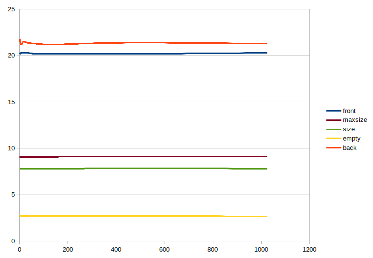
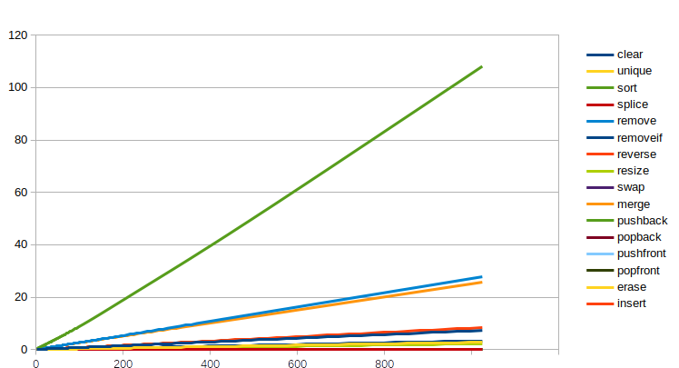

Powyżej są dodane dwa wykresy, uznałem, że dwa wykresy będą dobrym rozwiązaniem, ponieważ benchmarki które zwracały małe liczby
nie były widoczne na wykresie z uwzgłednieniem tych których wyniki sięgały niemal miliona nanosekund.
Wyniki na których się opierałem tworząc powyższe wykresy znajdują się w pliku resultsList.txt który się znajduje w katalogu output.
Jedynym wyjątkiem jest funkcja splice, dane do tej funkcji wziąłem z folderu który zawierał ostateczne wyniki.
Ten wyjątek nastąpił ze względu na to, że funkcja splice była modyfikowana, ponieważ wcześniej nie czyściłem listy na której się wykonywał
splice i dlatego złożoność wychodziła liniowa, a nie stała, tak jak w zasadzie powinna.
Również należy podkreślić to, że w niektórych funkcjach czas jest większy niż musi być, gdyż korzystałem z funkcji state.PauseTiming() oraz
state.ResumeTiming(). "Nadwyżka" spowodowana korzystaniem z danych funkcji na moim komputerze, średnio wynosi 600 ns.
Wszystkie złożonności wyszły takie same, jakie są na stronie [cppreference.com](http://en.cppreference.com/w/cpp/container).

Map:

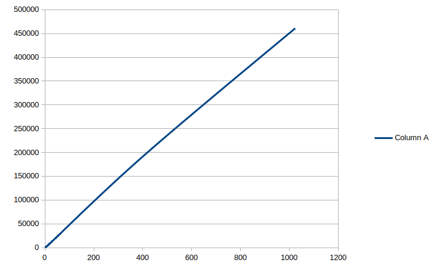
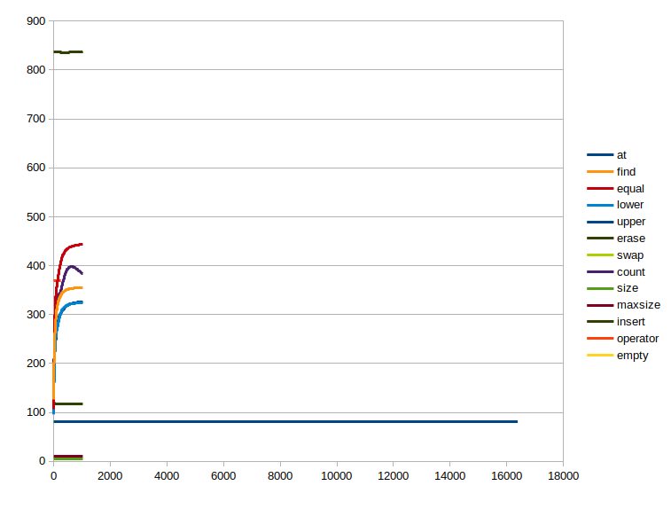

W tym przypadku również rozbiłem na dwa wykresy, ponieważ czas w funkcji Clear() jest tak duży, że na umieszaczając na wykresie obok niego
pozostałe funkcje po prostu nie widać. Wyniki były wzięte z pliku /output/resultsMappAllDebug.txt.
W dwóch funkcjach nie zgadzają się złożonności z tymi podanymi na stronie [cppreference.com](http://en.cppreference.com/w/cpp/container),  są to dane funkcje: at oraz operator.
Może to być dlatego, że argumenty tych funkcji są tworzone poza pętlą, czyli są cały czas takie same. Należy zauważyc, że jesteśmy do tego zmuszeni, ponieważ funkcja at, zwraca
błąd 'std::out_of_range' w momencie, gdy element o podanym kluczu nie istnieje w mapie, więc musi on tam istnieć. W pozostałych przypadkach złożonności się zgadzają.
Także należy zauważyć, że tak samo jak w listach korzystam z metod state.PauseTiming() oraz state.ResumeTiming(), w celu "pozbycia się" czasu niezbędnego na inicjalizację mapy, ale
za to czas jest zwiększany poprzez dane metody, tak jak wspomniałem wcześniej na moim komputerze czas ten wynosi ok. 600 ns.

UnorderedMultiset:

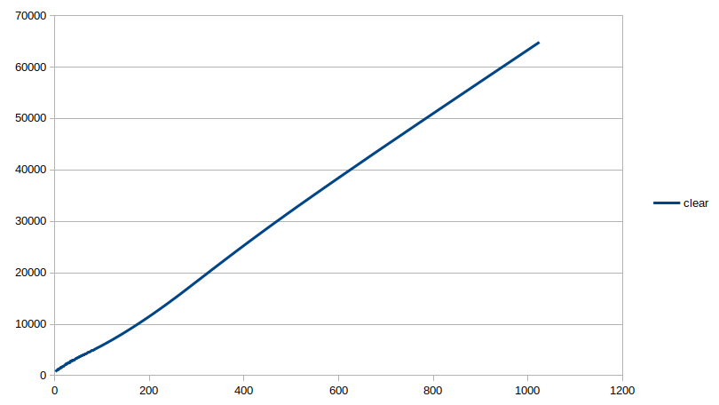
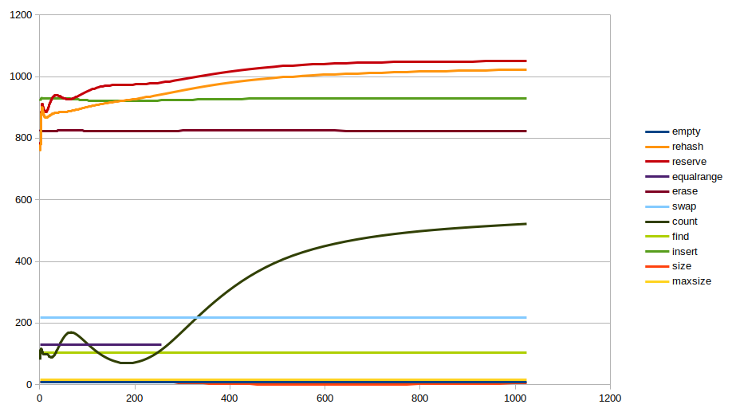

Jak widać, znowu dwa oddzielne wykresy, ze względu na powyżej opisane problemy. Także w niektórych przypadkach dodatkowo narzucone ~600ns w wyniku użycia state.PauseTiming oraz state.ResumeTiming().
W przypadkach funkcji equalrange, rehash a takze reserve widać, że złożonności się nie zgadzają z tymi podanymi na stronie [cppreference.com](http://en.cppreference.com/w/cpp/container). Tak się dzieje
dlatego, że funkcje są "spłycane" do złożonności innych funkcji o złożonności stałej, które są wywoływane obok nich.
z tego powodu, że obok nich używamy funkcji o złożonności stałej
## Release mode

W trybie Release mamy włączoną optymalizację, w przeciwieństwie do trybu Debug, w którym pracowaliśmy w poprzednim punkcie.
Optymalizator bardzo dobrze wykrywa kawałki kodu, z rezultatem którego nic nie robimy i po prostu go "wyrzuca" i musimy pracować w takiej kolejności by nie potknąć się o ten optymalizator, ponieważ
będzie on nam przeszkadzał.
Korzystamy z funkcji biblioteki DoNotOptimize() oraz ClobberMemory(), które nie pozwalają zoptymalizować nasz kod i usunąć to co jest w pętli w danym benchmarku.

Poniżej umieszczam wykresy przedstawiające różnice pomiędzy wynikami w trybie Debug oraz Release: 

List Debug          |  List Release
:-------------------------:|:-------------------------:
|  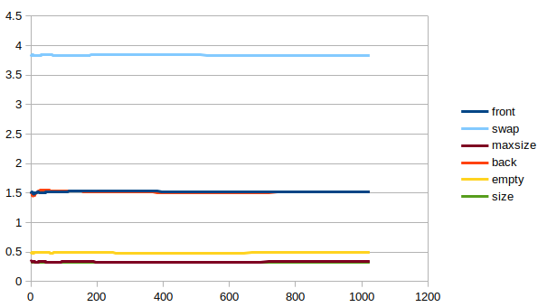
 | 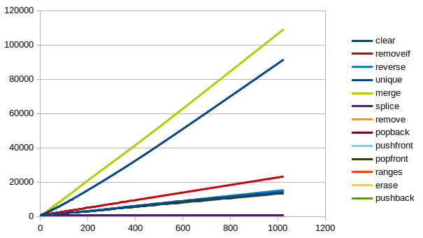 


Map Debug          |  Map Release
:-------------------------:|:-------------------------:
|  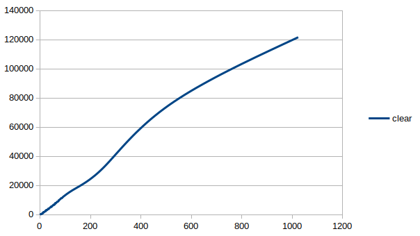
| 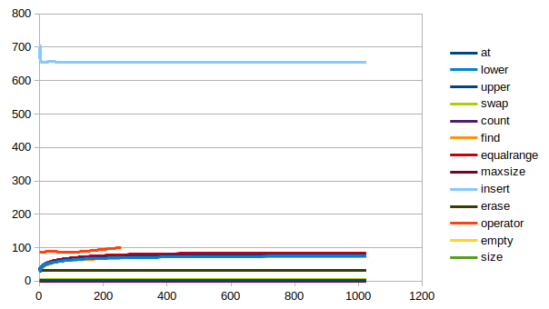

Unordered Multiset Debug          |  Unordered Multiset Release
:-------------------------:|:-------------------------:
 |  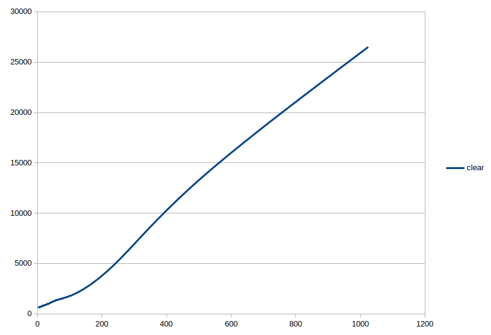
| 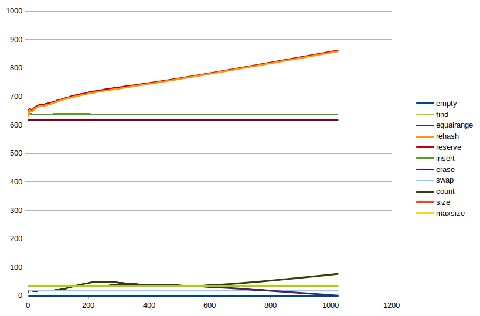

Po porównaniu wyników tekstowych, a także wykresów zrobionych na podstawie tych wyników widoczna jest bardzo duża różnica. W trybie release operacje są wykonywane od 2 do 40 razy szybciej.
Także jest widoczna lekka różnica w złożonności, w niektórych przypadkach, wykresy liniowe troche są spłycane do wykresów logarytmicznych, np wykres w funkcji Clear() w kontenerze Map.

## Debug i Release dla struktur Medium i Large

W danym podpunkcie w niektórych przypadkach zrezygnowałem z korzystania state.PauseTiming() oraz state.ResumeTiming(), ponieważ mój komputer po prostu zatrzymywał swoją pracę przy określonym rozmiarze
konteneru, i nie mógł dalej pracować.
Analizując wyniki widać, że przy tworzeniu kontenerów z coraz to większymi strukturami rośnie czas wykonywania funkcji w których jest dokonywana zmiana zawartości konteneru. W przypadkach, gdy
zawartość konteneru nie jest modyfikowana, czas wykonywania pozostaje taki sam. Również w niektórych przypadkach zmienia się złożoność, np z logarytmicznej do stałej, ponieważ liczby są tak duże, 
że zmiany są zbyt małe w stosunku do ich rozmiaru, więc wynik zostaje spłycony.
Nistety zdążyłem zrobić tylko jeden wykres, dla UnorderedMultiset w trybie Release, ale na nim widoczna jest "dominacja" czasu wykonywania funkcji ze strukturą typu Large, również należy zauważyć
to co podkreślałem wcześniej, niewydajna funkcja hashująca ma swój wkład do czasu tworzenia nieuporządkowanych kontenerów sekwencyjnych.

####UnorderedMultiset Release:


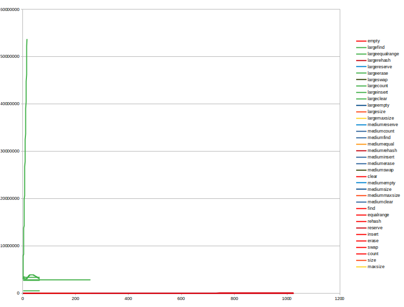